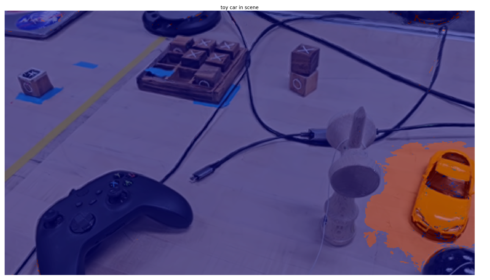
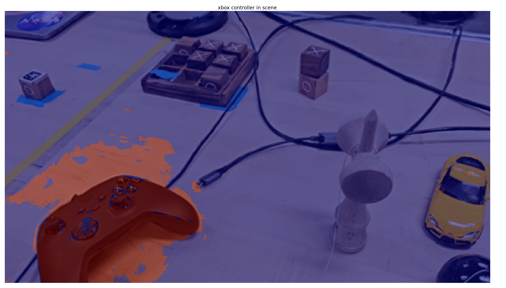

# 🐇 3DGS-LIL
3D Gaussian Splatting Language-Conditioned Imitation Learning


This work presents 3D Language Embedded Consistency Policy, a method for using language embeddings and Gaussian Splatting to learn a Consistency Policy. 

## Quickstart
This repository relies on two repos: a forked version of [LEGaussians](https://github.com/peasant98/LEGaussians) and [Consistency Policy](https://github.com/Aaditya-Prasad/Consistency-Policy/). We currently have most of the perception side of the pipeline working.
To get it setup, we have created a single shell script that will take care of dependencies.


```sh
bash perception.sh

```

After this, refer to LEGaussians for more steps on how to run.

In this project, we start from a language command, which you can find in `command.py`. This requires OpenAI API key access to run and installing from `requirements.txt`. Running this file gives the object that we can provide to LEGaussian and the action command to embed into Consistency Policy (still in the works).

An example is shown below


The robot policy side of this project is not complete. Setup consists of following [Consistency Policy](https://github.com/Aaditya-Prasad/Consistency-Policy/) to setup the `robomimic` environment.


## Example Gaussian Splatting Renderings with LEGaussian

Below are some masked out examples of LEGaussian on a real world scene that a robot might be asked to work in. Note that these images are novel views that a Gaussian Splatting model never saw.

Toy Car


Xbox controller




Sunglasses

